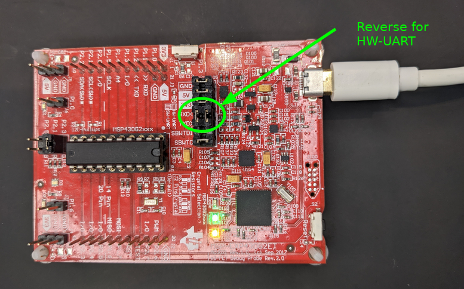

# printf to console via UART from an MSP430
This repository includes [mpaland/printf](https://github.com/mpaland/printf.git) and implements
the low level function _putchar to print data to console via UART from an MSP430G2553 (Launchpad).


# Background
Embedded systems are often tiny and including the printf implemenation from the
normal standard library is costly. Therefore, there exists stripped down implemenations
of printf like mpaland/printf. Moreover, we typically want to print to the console
on our computer, which can be achieved by transmitting the bytes over something like
a UART<->USB interface.

# How to set it up
This code has been verified on a Launchpad with MSP430G2553, but it should be easy to
adapt to other microcontrollers in the same family.

The easiest way to set it up is to create a new project in CCSTUDIO and do the
following:

## 1. Select your target MCU (e.g. (MSP430G2553) and choose GCC as compiler
It also works with the TI compiler, but then you must modify a line in the external/printf repo.

## 2. Add the files from this repo to the project
## 3. Add external/printf to the include paths


## 4. Add PRINTF_INCLUDE_CONFIG_H as a define symbol

## 5. Exclude external/printf/test from the build


## 6. Flip the UART bridges
If you are on a Launchpad you must also flip the UART bridges:



## 7. Connect USB and open console program
Once you have everything set up, you should be able to see the prints in your
favorite console. On Linux, it should show up under /dev/tty<...>.
For example, I like to use picocom, so for me the command is:

```console
picocom -b 9600 /dev/ttyACM1
```
